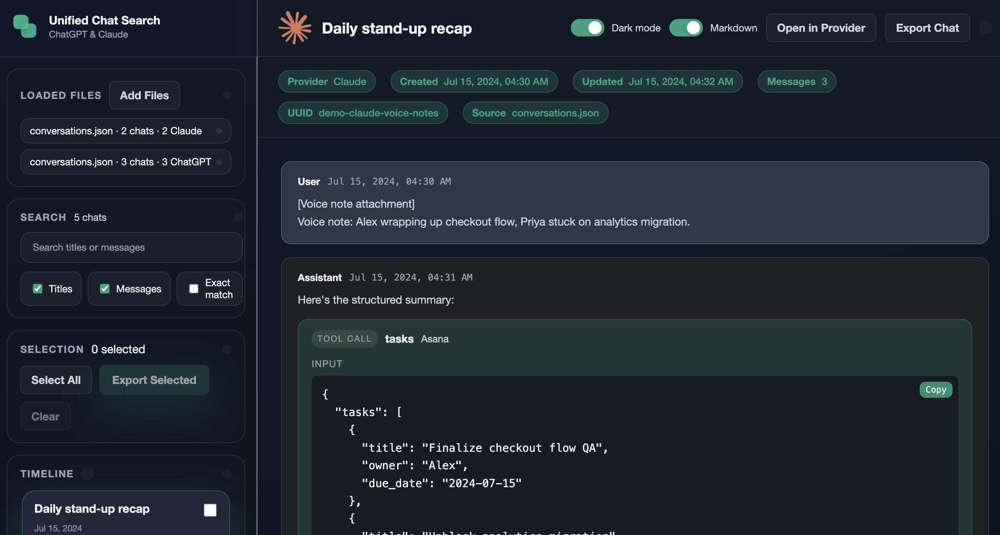
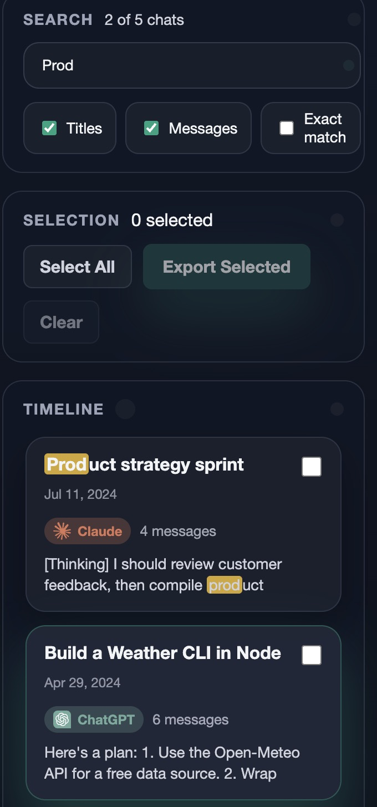

# Unified Chat Search

A privacy-focused, client-side web application for searching, viewing, and exporting conversations from multiple AI chat providers in a single unified interface.

**🌐 Try it now: [unifiedchatsearch.com](https://unifiedchatsearch.com/)**

[](LICENSE)

## Overview

Unified Chat Search lets you load conversation exports from ChatGPT and Claude, search across all your AI conversations simultaneously, and export selected chats to Markdown. All processing happens locally in your browser—your data never leaves your device.


**Key Benefits:**

- 🔒 **Complete Privacy**: All processing happens in-browser—no server uploads, no data collection
- 🔍 **Unified Search**: Search across all your conversations from multiple providers at once
- 📦 **Single File**: No installation, no build process, no dependencies to manage
- 🎨 **Modern Interface**: Polished UI with dark mode, markdown rendering, and responsive design
- 💾 **Export Anywhere**: Export conversations as clean Markdown files for archival or analysis

## Features

### Core Functionality



- **Multi-Provider Support**: Load conversations from ChatGPT and Claude simultaneously
- **Fuzzy Search**: Search across conversation titles and message content with real-time results
- **Rich Message Display**: Render messages with markdown support, code syntax highlighting, and tool/function call blocks
- **Flexible Export**: Export selected conversations as single or separate Markdown files
- **Batch Operations**: Select multiple conversations for bulk export with "Select All" functionality

### User Experience

- **Dark Mode**: Toggle between light and dark themes with persistent preference
- **Markdown Rendering**: Optional markdown rendering for message content
- **Search Scopes**: Filter searches by conversation titles only or full message content
- **Provider Indicators**: Visual badges distinguish ChatGPT and Claude conversations
- **File Management**: Load multiple export files, track sources, and remove individual files
- **Responsive Design**: Modern interface with smooth transitions and animations

### Technical Features

- **ZIP Support**: Directly load official export ZIP files from both providers
- **Format Detection**: Automatically detects and normalizes different conversation formats
- **Progress Tracking**: Loading progress indicator for large imports
- **State Persistence**: Remembers your preferences, search query, and UI state across sessions
- **Syntax Highlighting**: Code blocks with copy-to-clipboard functionality
- **Error Handling**: Graceful handling of malformed data with user-friendly warnings

## Getting Started

### Requirements

- A modern web browser (Chrome, Firefox, Safari, Edge)
- Conversation exports from ChatGPT and/or Claude

### Installation

No installation required. Simply open `index.html` in your web browser:

#### **Option 1: Direct Open**

```bash
open index.html
```

#### **Option 2: Local Server** (optional, for testing)

```bash
python3 -m http.server 8000
# Then navigate to http://localhost:8000
```

#### **Option 3: Download and Open**

1. Download or clone this repository
2. Double-click `index.html` in your file manager

### Obtaining Conversation Exports

#### ChatGPT

1. Go to [ChatGPT](https://chat.openai.com/)
2. Click your profile → Settings
3. Navigate to **Data Controls** → **Export Data**
4. Request export and download the ZIP file when ready
5. Use the ZIP file directly or extract `conversations.json`

#### Claude

1. Go to [Claude](https://claude.ai/)
2. Click your profile → Settings
3. Navigate to **Privacy & Data** → **Export Data**
4. Request export and download the ZIP file when ready
5. Use the ZIP file directly (contains conversation data)

## Usage

### 1. Load Conversations

- **Drag and Drop**: Drag ZIP files or JSON files onto the upload area
- **Browse**: Click to browse and select files from your computer
- **Multiple Files**: Load multiple files from different providers at once

Supported file types:

- ChatGPT: `conversations.json` or official export ZIP
- Claude: Official export ZIP containing conversation data

### 2. Search Conversations



- Type in the search bar to find conversations by title or content
- Toggle **search scope** to search titles only or full message content
- Search results update in real-time as you type
- Uses fuzzy matching for flexible searching
- Search across **multiple providers simultaneously**—find conversations from both ChatGPT and Claude in one unified search

### 3. View Conversations

- Click any conversation in the sidebar to view full message history
- Messages display with role indicators (User, Assistant, System, Tool)
- Code blocks include syntax highlighting and copy buttons
- Tool calls and results are rendered in structured blocks
- Toggle markdown rendering on/off for raw text view

### 4. Export Conversations

1. Select one or more conversations using checkboxes
2. Use **"Select All"** to select all visible/filtered conversations
3. Click **"Export Selected"** to configure export options:
   - **Single file**: Combine all selected conversations into one Markdown file (even from different providers)
   - **Separate files**: Export each conversation as an individual Markdown file
   - **Filename prefix**: Add an optional prefix for organization
4. Downloads are generated client-side as `.md` files

### 5. Manage Preferences

- **Dark Mode**: Toggle for comfortable viewing in any lighting
- **Markdown Rendering**: Enable/disable markdown rendering for message content
- **File Management**: View loaded sources and remove individual files
- **Sidebar**: Collapse/expand sidebar for more viewing space
- All preferences persist across sessions via localStorage

## Technical Architecture

### Structure

- **Single-File Application**: Complete application in one HTML file (~4800 lines)
- **No Build Process**: No compilation, bundling, or transpilation required
- **Zero Server Dependencies**: Runs entirely client-side with no backend
- **Modern Web Standards**: Built with vanilla JavaScript, CSS3, and HTML5

### Dependencies (CDN)

All dependencies are loaded from CDN—no package manager required:

- [Fuse.js](https://fusejs.io/) (v6.6.2): Fuzzy search functionality
- [Marked](https://marked.js.org/) (v9.1.6): Markdown parsing and rendering
- [JSZip](https://stuk.github.io/jszip/) (v3.10.1): Client-side ZIP file processing
- [Font Awesome](https://fontawesome.com/) (v6.5.2): Icon library

### Key Components

- **Conversation Normalization**: Detects and normalizes ChatGPT and Claude conversation formats into a unified schema
- **Search Engine**: Configurable fuzzy search with title-only or full-content modes using Fuse.js
- **Markdown Renderer**: Secure HTML sanitization with code block enhancement and syntax highlighting
- **Export Engine**: Generates formatted Markdown files with metadata and proper escaping
- **State Management**: localStorage-based preference and state persistence
- **Tool Block Rendering**: Specialized rendering for tool/function calls and results

### Data Format

Conversations are normalized to a unified structure:

```javascript
{
  id: string,                    // Unique conversation identifier
  provider: 'chatgpt' | 'claude', // Source provider
  title: string,                 // Conversation title
  created: timestamp,            // Creation timestamp
  updated: timestamp,            // Last update timestamp
  sourceFileName: string,        // Original source file name
  metadata: {                    // Provider-specific metadata
    conversationId: string,      // ChatGPT conversation ID
    uuid: string                 // Claude conversation UUID
  },
  messages: [
    {
      id: string,                // Message identifier
      role: 'user' | 'assistant' | 'system' | 'tool',
      text: string,              // Plain text content
      textSegments: [            // Structured segments for rendering
        {
          type: 'text' | 'code' | 'tool',
          text: string,
          markdown: string,      // Markdown-formatted content
          language: string,      // Code block language
          toolName: string       // Tool/function name
        }
      ],
      timestamp: timestamp       // Message timestamp
    }
  ]
}
```

## Privacy & Security

- **Local Processing**: All operations execute in your browser's JavaScript runtime
- **No Network Requests**: After loading CDN libraries, operates entirely offline
- **HTML Sanitization**: User content is sanitized before rendering to prevent XSS attacks
- **No Analytics**: No tracking, telemetry, or analytics of any kind
- **No Data Persistence**: Conversations are loaded into memory and cleared on page reload
- **Minimal localStorage**: Only UI preferences are stored locally (dark mode, search state, etc.)
- **No Cookies**: Application does not use cookies

### What Gets Stored

The application stores only these preferences in localStorage:

- `ucs.pref.darkMode`: Dark mode toggle state
- `ucs.pref.markdown`: Markdown rendering toggle state
- `ucs.pref.language`: UI language preference
- `ucs.pref.rememberScroll`: Scroll position preference
- `ucs.pref.sidebarCollapse`: Sidebar collapse state
- `ucs.state.searchQuery`: Last search query
- `ucs.state.searchScopes`: Search scope preferences

**Conversation data is never persisted to disk by the application.**

## Browser Compatibility

Tested and working in:

- ✅ Chrome/Edge (Chromium-based browsers)
- ✅ Firefox
- ✅ Safari

Requires modern JavaScript features:

- ES6+ syntax (arrow functions, destructuring, template literals)
- Async/await
- LocalStorage API
- File API
- Blob API
- crypto.randomUUID (with fallback)

## Project Structure

```bash
unified-chat-search/
├── index.html              # Complete application (single file)
├── README.md              # This file
├── LICENSE                # MIT License
└── .gitignore            # Git ignore rules
```

**Optional data directory** (git-ignored):

```bash
data/
├── chatgpt-export/       # Your ChatGPT exports
└── claude-export/        # Your Claude exports
```

## Development

The application is intentionally built as a single HTML file for maximum portability and simplicity.

### Modifying the Application

1. Open `index.html` in your preferred editor
2. The file contains three main sections:
   - **Styles** (lines ~15-1500): CSS variables, component styles, animations
   - **Markup** (lines ~1500-1780): HTML structure and layout
   - **Scripts** (lines ~1780-4790): Application logic and functionality
3. External dependencies are loaded from CDN—no package manager required
4. Test changes by refreshing the page in your browser

### Code Organization

The JavaScript is organized into logical sections:

- **Constants & Configuration**: Provider definitions, storage keys, UI translations
- **Element References**: DOM element caching for performance
- **State Management**: Application state object and persistence
- **Initialization**: Setup, event binding, preference restoration
- **File Processing**: ZIP handling, JSON parsing, format detection, normalization
- **UI Rendering**: Conversation list, message display, metadata rendering
- **Search**: Fuzzy search implementation with Fuse.js
- **Export**: Markdown generation and file downloads
- **Utilities**: Helper functions for formatting, sanitization, and DOM manipulation

### Making Contributions

1. Fork the repository
2. Create a feature branch (`git checkout -b feature/improvement`)
3. Make your changes to `index.html`
4. Test thoroughly in multiple browsers
5. Commit your changes (`git commit -am 'Add improvement'`)
6. Push to the branch (`git push origin feature/improvement`)
7. Create a Pull Request

**Guidelines:**

- Maintain the single-file architecture
- Follow existing code style and conventions
- Test in Chrome, Firefox, and Safari
- Ensure privacy-first design principles are maintained
- Document any new features in the README

## License

MIT License - see [LICENSE](LICENSE) file for details.

Copyright (c) 2025 Henry Sowell

## Acknowledgments

Special thanks to [@levysoft](https://github.com/levysoft) for [llm-chat-explorer](https://github.com/levysoft/llm-chat-explorer), which served as an inspiration for this project.

Built with modern web standards and powered by excellent open-source libraries:

- [Fuse.js](https://fusejs.io/) for intelligent fuzzy search
- [Marked](https://marked.js.org/) for reliable markdown parsing
- [JSZip](https://stuk.github.io/jszip/) for client-side ZIP processing
- [Font Awesome](https://fontawesome.com/) for beautiful icons

## Roadmap

Potential future enhancements:

- Support for additional AI providers (Gemini, Perplexity, etc.)
- Advanced filtering (by date range, provider, message count)
- Conversation statistics and analytics
- Import/export of application state
- Customizable themes and color schemes
- Keyboard shortcuts for power users

## Support

If you encounter issues or have questions:

1. Check the [Issues](https://github.com/veteranbv/unified-chat-search/issues) page
2. Search for existing issues or create a new one
3. Provide details about your browser, OS, and the issue

## FAQ

**Q: Is my conversation data sent to any server?**
A: No. All processing happens locally in your browser. The application only loads external libraries from CDN on first use.

**Q: Can I use this offline?**
A: After the first load (which fetches CDN libraries), you can save the page and use it offline.

**Q: What happens to my conversation data?**
A: Conversation data is loaded into browser memory and cleared when you close/reload the page. It is never saved or transmitted.

**Q: Which file should I load from my ChatGPT export?**
A: You can load either the entire ZIP file or just the `conversations.json` file from the extracted archive.

**Q: Why is the application a single HTML file?**
A: For maximum portability, simplicity, and privacy. You can audit the entire codebase in one file and run it anywhere.

**Q: Can I customize the styling?**
A: Yes. The CSS is in the `<style>` section at the top of `index.html`. Modify CSS variables in `:root` for global changes.

**Q: Does this work on mobile?**
A: The UI is responsive and works on mobile browsers, though the experience is optimized for desktop.

---

<div align="center">

**[⭐ Star on GitHub](https://github.com/veteranbv/unified-chat-search)** • **[🌐 Try Live Demo](https://unifiedchatsearch.com/)** • **[📝 View Source](https://github.com/veteranbv/unified-chat-search)**

</div>
